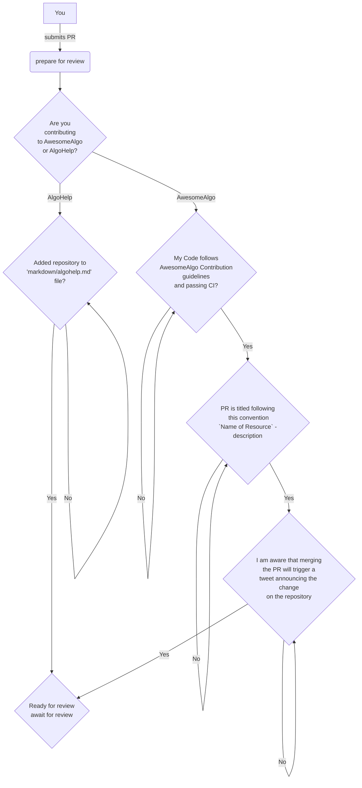

<div align="center">
<a href="https://github.com/aorumbayev/awesome-algorand"></a>
</div>
<br/>

# Pull request:

_Please include a summary of the resource you're suggesting below:_

# Checklist:

_Please make sure you reviewed the checklist and comply with each requirement (choose preferred option):_

<details><summary>Option 1. Flow diagram guideline 🖼️</summary>



</details>

<details><summary>Option 2. Text guideline 📜</summary>

## You are submiting a new resource on AwesomeAlgo:

> ⚠️ PLEASE NOTE - Do not expect a prompt review for your PR unless you have truthfully went over contribution guidelines, filled the PR description correctly AND most importantly your changes are passing linters in [GitHub Actions pipeline](https://github.com/aorumbayev/awesome-algorand/actions/workflows/ci.yaml).

-   [ ] My code follows the [contribution guidelines](../CONTRIBUTING.md) of this project
-   [ ] (**IMPORTANT**) This pull request title **must** have title in the following format `{Name of Resource} - description`. For example, if you're adding a new resource named `Awesome Algorand`, your pull request title must be `Awesome Algorand - a curated list of resources...`.
-   [ ] I am aware that the PR title will be used as part of the automated tweet that will be sent on behalf of `@awesome_algo`'s official twitter account once this PR is merged.
    -   For your reference, the tweet message is assembled as follows:
    ```
    "⭐️ Check out ${{ steps.PR.outputs.pr_title }} on AwesomeAlgo website. Head to awesomealgo.com to explore #awesome tools and platforms in #algorand ecosystem. ⚡️"
    ```

## If you are adding a new PR for [AlgoHelp](algohelp.awesomealgo.com):

> ⚠️ PLEASE NOTE - I kindly request that only pull requests from individuals or teams officially affiliated with Algorand Inc, Foundation or a team behind a platform/utility that provides engineering resources to support the adoption of Algorand by developers or the overall wellbeing of the ecosystem are submitted. This is to ensure that the community has access to the most relevant and useful information.

-   [ ] I have updated the [AlgoHelp](https://github.com/aorumbayev/awesome-algorand/blob/main/markdown/algohelp.md) file by appending the new repository.

</details>

## <br>

### (Optional) AwesomeAlgo Podcast

Are you a creator/owner of your contribution and would like to do a technical deep dive into challenges and experieance learned during development of those tools with a bigger audience of developers in the ecosystem? Submit the sign up form below:

[Sign up form](https://2c5n1ed3kz6.typeform.com/to/pAP5oPFx)
